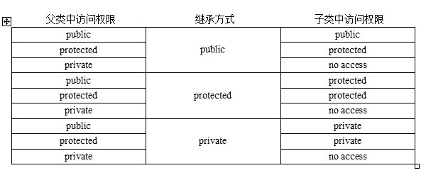

# 继承

## 三种继承方式

- 单一继承
	- 最普通的继承
- 多重继承
	- 类与类之间要用括号隔开，类名前有继承权限，名字相同的变量和函数在子类调用时需要加上类名限定符，比如`obj.classA::i = 1;`
- 菱形继承
	- 需要使用虚继承，令B、C虚继承A，D再多重继承B、C

# 多态

## 三种多态形式

- 重载
	- 函数重载和运算符重载
	- 静态多态
	- 发生在编译期
- 虚函数
	- 子类的多态性
	- 动态多态
	- 运行时
	- 根据指针或引用指向的对象判断调用子类还是父类的函数
- 类模板、函数模板
	- 静态多态
	- 编译期