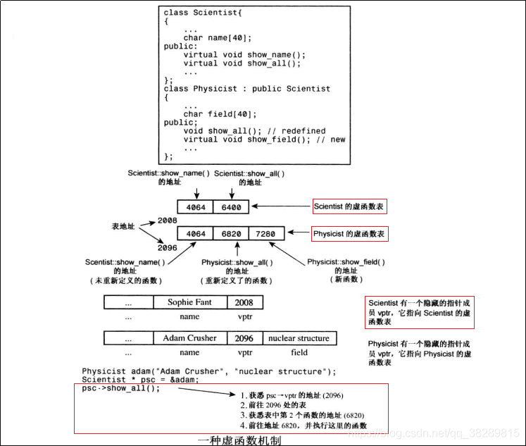
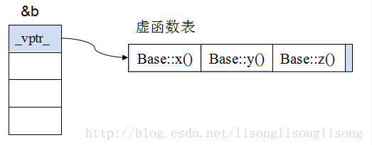
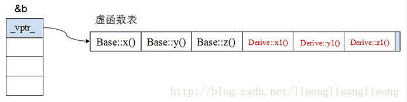
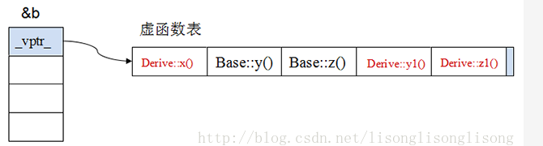
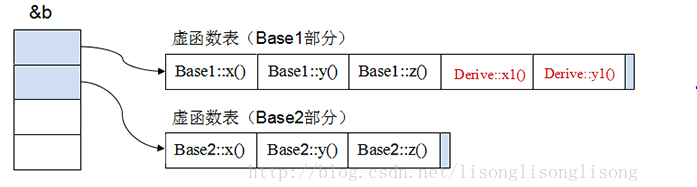

# 继承

## 三种继承方式

- 单一继承
	- 最普通的继承
- 多重继承
	- 类与类之间要用括号隔开，类名前有继承权限，名字相同的变量和函数在子类调用时需要加上类名限定符，比如`obj.classA::i = 1;`
- 菱形继承
	- 需要使用虚继承，令B、C虚继承A，D再多重继承B、C


- C++中**类**默认是private继承
- C++中**结构体**默认是public继承
## 不能继承的成员

- **构造函数**一般不可以继承
- C++11中引入了构造函数继承，可以通过如下方式使用
```C++[]
class C : public A, public B {
public:
    using A::A; // 继承 A 的构造函数
    using B::B; // 继承 B 的构造函数
};
```
- 对于基类的每个构造函数，编译器都在派生类中生成一个形参列表完全相同的构造函数
- 不会改变构造函数的访问级别（私有还是私有）
- 继承的构造函数不能加explicit或者constexpr，可以从基类继承来这些特性
- **析构函数**不能继承
- **赋值运算符**不能继承
- C++有final关键字防止派生类覆盖基类方法
- 友元+虚继承
```C++[]
class CFinalClassMixin {//从这个类中继承的类都不能再被继承
  friend class Cparent;
private:
  CFinalClassMixin() {}
  ~CFinalClassMixin(){}
};
class Cparent: virtual public CFinalClassMixin, public CXXX {
public:
  Cparent() {}
  ~Cparent(){}
};
class CChild : public Cparent {
public:
  CChild() {};//编译错误
  ~CChild() {};//编译错误
};
```

# 多态

## 三种多态形式

- 重载
	- 函数重载和运算符重载
	- 静态多态
	- 发生在编译期
- 虚函数
	- 子类的多态性
	- 动态多态
	- 运行时
	- 根据指针或引用指向的对象判断调用子类还是父类的函数
- 类模板、函数模板
	- 静态多态
	- 编译期

## this指针

- 当对一个对象调用成员函数时，编译程序先将对象的地址赋给 `this` 指针，然后调用成员函数，每次成员函数存取数据成员时，都隐式使用 `this` 指针
- `this`指针是右值，无法`&this`
- `this`在成员函数的开始执行前构造，在成员的执行结束后清除
- `this`指针会因编译器不同而有不同的放置位置，可能是栈，也可能是寄存器，甚至全局变量
- `this`指针只在成员函数中才有定义，所以不能通过对象本身来访问
- 在类对象的内存空间中，只有数据成员和虚函数表指针
- 类的成员函数单独放在代码段中
- 在类的析构方法中若写`delete this`则会发生无限递归，因为delete本身就会调用析构方法

## 虚函数

- **父类指针指向子类对象，通过该指针不能访问子类新增的成员函数**

- 原始基类的虚函数表

- 单继承时的虚函数（**无重写基类虚函数**）

- 单继承时的虚函数（**重写基类虚函数**）

- 多重继承时的虚函数`Derived ::public Base1,public Base2`

- 虚函数的代价
	- 虚函数表相当于几个函数指针的体积，大量虚函数会使vtbl占据更大空间
	- 如果子类只覆盖父类的一小部分虚函数，会造成大量空间浪费
	- 虚表指针在多重继承的轻量级类中带来很大的空间开销
- 构造函数不能是虚函数，因为要实例化才能有虚函数表，从而调用虚函数
- 子类构造函数会先调用父类构造函数来初始化继承来的成员
- 父类的析构函数必须是虚函数，否则只会调用指针类型而不是对象类型的析构函数
```C++[]
Employee* pe = new Singer;
delete pe; // 只会调用Employee的析构函数而不会调用Singer类的析构函数
```
- 以下函数不能是虚函数
	- 友元函数不是类成员，不能成为虚函数
	- 静态类成员函数
		- 其不属于任何对象或实例
		- 其不含`this`指针，也就无法`this->vptr->vtable->virtual function`调用虚函数
	- 内联函数需要编译时展开，虚函数要动态绑定，且内联函数没有地址，没法放进vtbl
	- 成员函数模板的实例化在调用时发生，虚函数需要在创建对象时确定
- 虚函数表是一个类的所有对象共享的，gcc实现中vtb存在可执行文件中的只读数据段.rodata中
- vtbl存在可执行文件中，运行前加载到内存就行
- 如果对象分配在堆上，vptr也跟着在堆上；如果对象分配在栈上，vptr也在栈上……
- 子类处理虚函数表的过程：
	1. 拷贝基类的虚函数表，如果是多继承，就拷贝每个基类的虚函数表
	2. 查看派生类中是否有重写基类的虚函数，如果有，就替换成已经重写后的虚函数地址
	3. 查看派生类中是否有新添加的虚函数，如果有，就加入到自身的虚函数表中
- **若在构造函数或析构函数中调用虚函数，则由于对象构造顺序，调用的都是基类虚函数**
- 获取虚表地址以及虚函数地址
```C++[]
class Base {
public:
    virtual void f() { cout << "Base::f" << endl; }
    virtual void g() { cout << "Base::g" << endl; }
    void h() { cout << "Base::h" << endl; }
};
Base b;
//  1.&b代表对象b的起始地址
//  2.(int *)&b 强转成int *类型,为了后面取b对象的前4个字节,前四个字节是虚表指针
//  3.*(int *)&b 取前四个字节,即vptr虚表地址
printf("虚表地址:%p\n", *(int *)&b);
//  根据上面的解析我们知道*(int *)&b是vptr,即虚表指针.并且虚表是存放虚函数指针的
//  所以虚表中每个元素(虚函数指针)在32位编译器下是4个字节,因此(int *)*(int *)&b
//  这样强转后为了后面的取四个字节.所以*(int *)*(int *)&b就是虚表的第一个元素.
printf("第一个虚函数地址:%p\n", *(int *)*(int *)&b);
printf("第二个虚函数地址:%p\n", *((int *)*(int *)(&b) + 1));
//  始终记着vptr指向的是一块内存,
//  这块内存存放着虚函数地址,这块内存就是我们所说的虚表.
//  64位下把int换成longlong就好了
```


## C语言编译时多态

`#define DEBUG_PRINT(...) printf(__VA_ARGS__);`
- `__VA_ARGS__`在宏中代表任意参数，会被传入宏的参数所代替
- 上面这个宏会被这样使用`DEBUG_PRINT("Value of x: %d\n", x);`
- 那么下面这样就可以简单实现C中的多态
```C++[]
#define func(...) myfunc((struct mystru) { __VA_ARGS__})
struct mystru
{
    const char *name;
    double d;
    int number;
};
void myfunc(struct mystru ms)
{
    printf("%s, %lf, %d\n", ms.name, ms.d, ms.number);
}
int main(int argc, char *argv[])
{
    func();
    func("hello", 1.1);
    func("hello");
    func("hello", 1.1, 100);
    func(.name = "hello");
    func(.d = 1.1);
    func(.number = 100);
    func(.d = 1.1, .name = "hello");
	return 0;
}
```

## C语言运行时多态

- 利用函数指针，在父类结构体中定义vptr指向一个存有函数指针的结构体vtbl
- 子类结构体中有父类结构体成员，初始化时将内部的父类函数指针指向子类函数
- 接下来这样使用
```C++[]
/*******实际调用***********/
 struct base * bas = new_base();
//这里调用的是基类的成员函数
bas->vptr->dance();
bas->vptr->jump();

struct derived1 * child = new_derived1(100);
//基类指针指向派生类
bas  = (struct base *)child;

//这里调用的其实是派生类的成员函数
bas->vptr->dance();
bas->vptr->jump((void *)bas);
```

## 纯虚函数

- 定义一个纯虚函数类似定义一个接口，规范后续子类
- 有纯虚函数的类叫做抽象基类，无法实例化对象
- 纯虚函数这样定义
```C++[]
class Shape { public: virtual double area() const = 0;};
```

# 构造函数和析构函数

## 只能在堆上生成对象的类

- **编译器在调用构造函数为类的对象分配空间时，会先检查析构函数和非静态函数的访问性**
- 如果析构函数是私有的，则编译器无法自动为其调用析构函数，所以一开始就无法在栈上
- 但子类无法访问父类的private成员，可以访问protected成员
- 析构函数写成private也无法delete，因此可以这样写
```C++[]
class  A  
{  
protected :  
    A(){}  
    ~A(){}  
public :  
    static  A* create() { return  new  A(); }  
    void  destory() { delete  this ; }  
};  
```

## 只能在栈上生成对象的类

- 可以重载`new`为私有
```C++[]
class  A  
{  
private :  
    void * operator  new ( size_t  t){}     // 注意函数的第一个参数和返回值都是固定的 
    void  operator  delete ( void * ptr){}  // 重载了new就需要重载delete   
public :  
    A(){}  
    ~A(){}  
}; 
```

## 阻止实例化

- 可在类中包含纯虚函数
- 可把构造函数设为private

## C++的构造函数

- **默认构造函数**
	- 如果没有实现构造函数，则编译器会自动生成一个默认构造函数
- **一般构造函数**
	- 包含各种参数，根据传入参数调用不同构造函数
- **拷贝构造函数**
	- 没有实现拷贝构造函数的话，编译器会默认创建一个拷贝构造函数
	- 如果类成员变量有指针的话，最好还是实现一个深拷贝构造函数
- **移动构造函数**
	- 避免了多余的对象占用空间
	- 可以浅拷贝指针
	- 要避免第一个指针释放空间，可以直接设为NULL
- 赋值构造函数
	- 重载 = 运算符
	- 类似拷贝构造函数
- 类型转换构造函数
	- 涉及了以别的类对象为参数的构造函数以及隐式转换的使用
	- 可以使用explicit防止隐式转换

## 什么时候会调用拷贝构造函数

1. 对象以值传递方式进入函数体
2. 对象以值传递方式从函数体返回
3. 一个对象需要另一个对象来初始化

## 为什么拷贝构造函数参数必须是引用

- 不引用就会是值传递的方式
- 值传递方式传递对象会调用拷贝构造函数
- 因此发生无限递归

## 构造函数析构函数能否抛出异常

- **构造函数可以抛出异常，但会导致析构函数不被执行**
- 子类的构造函数发生异常，父类的构造和析构函数都可以**正常执行**
- 可以将资源交给智能指针管理

- **析构函数不能也不该抛出异常**
- 因为析构函数其实是异常处理的一部分
- 异常处理时会进行栈展开，过程中对函数栈帧调用析构函数
- 若析构函数中发生异常，则前一个异常尚未处理又有新的异常
- 可以把异常完全封闭在析构函数内部，不让其抛出函数之外
```C++[]
DBConn::~DBconn()
{
    try
    {
	    db.close(); 
    }
    catch(...)
    {
        abort();
    }
}
//如果close抛出异常就结束程序，通常调用abort完成：
```

## 构造函数的执行顺序

1. 基类构造函数：如果有多个基类，则按继承的顺序`class C : public A, public B`先A后B
2. 成员类对象构造函数：按声明顺序构造
3. 派生类构造函数
>析构函数正相反

## 成员变量的初始化顺序

1. 声明时初始化
2. 初始化列表初始化
3. 构造函数初始化

- 初始化列表中顺序不决定其初始化顺序，由定义顺序决定
- 如果在构造函数中初始化，则由在构造函数中的位置决定
- 类成员不能在声明时初始化
- static成员变量必须在类外初始化
- 按程序开始到结束的顺序，类内变量的初始化顺序为
	1. 基类静态，按程序中出现的顺序
	2. 派生类静态，按程序中出现的顺序
	3. 基类普通，再执行基类的构造函数
	4. 派生普通，再执行派生类构造函数