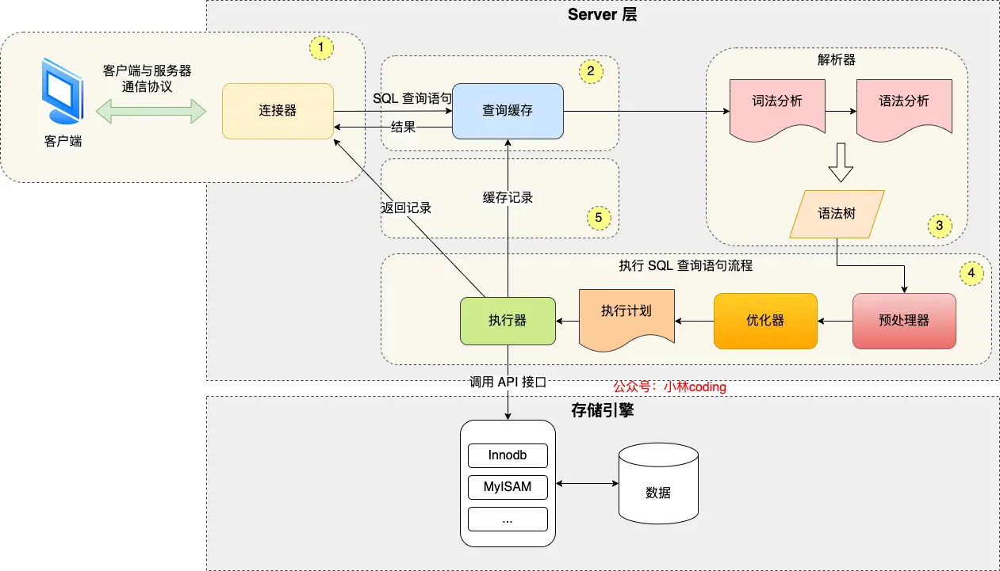

# MySQL执行流程

- **Server 层负责建立连接、分析和执行 SQL**，主要包括连接器，查询缓存、解析器、预处理器、优化器、执行器等；所有内置函数和跨存储引擎的功能
- **存储引擎层负责数据的存储和提取**，不同的存储引擎共用一个 Server 层

## 连接器

- MySQL可以通过多个方式连接
1. TCP连接`mysql -h hostname -P port -u username -p`，唯一可以远程连接的方式
2. socket连接，指定socket文件路径（类Unix）`--socket={file_name|pipe_name}`
3. named pipe连接指定命名管道名称（Windows）`--socket={file_name|pipe_name}`
4. shared memory连接（Windows）`--shared-memory-base-name=name`
[参考](https://dev.mysql.com/doc/refman/8.0/en/connection-options.html#option_general_protocol)

- `show processlist`可以查看MySQL服务被多少客户端连接了

- 空闲连接不会一直占用，默认wait_timeout是8小时，超时自动断开
- 也可以`mysql> kill connection +6;`断开6号用户
- max_connections控制最大连接数，超过会报错
- MySQL也分长连接短连接，和HTTP有点像；可以定期断开或客户端主动重置连接

## 查询缓存

- MySQL8.0删掉了这个功能
- 之前版本也可以关

## 解析SQL

- 解析器词法分析、语法分析
- 表不存在或者字段不存在，并不是在解析器里做的

## 执行SQL

- 预处理阶段：检查查询语句中表或字段是否存在，将 \* 扩展为全部列
- 优化器：选择最适合的执行方案
- 执行器：据执行计划执行 SQL 查询语句，从存储引擎读取记录，返回给客户端

# MySQL数据存放

## 数据存放在哪个文件？

- 可以用`mysql> SHOW VARIABLES LIKE 'datadir';`查询位置
- 目录中会存在三种文件
1. db.opt，存放当前数据库的默认字符集和字符校验规则
2. xxx.frm，存放xxx表的表结构，元数据信息
3. xxx.ibd，存放xxx表的表数据

##  表空间文件的结构

- 一行记录除了 TEXT、BLOBs 类型的列，限制最大为 65535 字节
- **InnoDB 的数据是按「页」为单位来读写的**，读一条记录的时候，并不是将这个行记录从磁盘读出来，而是以页为单位，将其整体读入内存
- **默认每个页的大小为 16KB**
- 页是 InnoDB 存储引擎磁盘管理的最小单元，意味着数据库每次读写都是以 16KB 为单位的
- 比如一行达到了65535字节，溢出的部分则会存到溢出页
- 一次最少从磁盘中读取 16K 的内容到内存中，一次最少把内存中的 16K 内容**刷新到磁盘中**
- **数据量大时**，可能会为索引按**区**分配内存空间，一个区为1MB，能存64个连续页，减少链表造成的随机IO
- 索引段：存放 B+ 树的非叶子节点的区的集合；
- 数据段：存放 B+ 树的叶子节点的区的集合；
- 回滚段：存放的是回滚数据的区的集合

## InnoDB行格式

